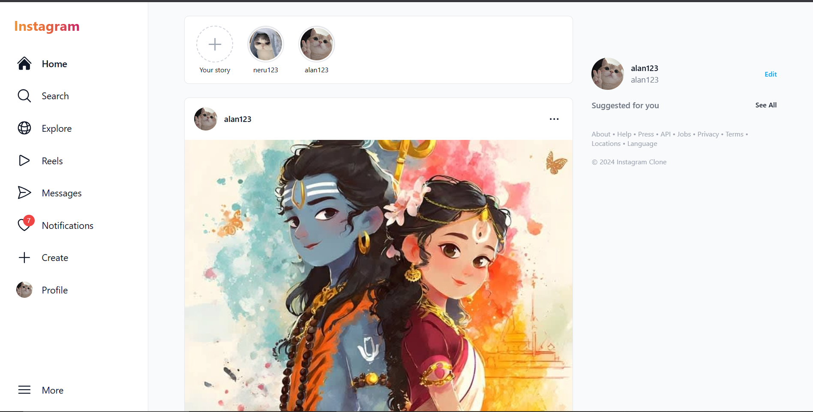

# Instagram Clone - MERN Stack 📸

A modern, full-featured social media web application inspired by Instagram, built with the MERN stack. Share moments through posts, reels, and stories while connecting with friends through real-time messaging.



> **Note**: Add a screenshot of your home page to `screenshots/home.png` to see the image above!

## ✨ What's New & Featured

### 🎯 Latest Features (Just Added!)
✅ **Smart Create** - One upload button: photos become posts, videos become reels  
✅ **Online Status** - Green dot + "Active now" or "Active 2h ago" in messages  
✅ **Story Viewer Redesign** - Vertical phone-style layout with like button  
✅ **Notification Badges** - Red dots show unread messages and notifications  
✅ **Like Bug Fixed** - One user can only like once per post/story/reel  
✅ **Real-time Everything** - Socket.io for instant updates  

### Core Features

#### 👤 Authentication & Profile
- User registration with full name
- Login/Logout with JWT tokens
- Edit profile with bio and picture
- Follow/unfollow users
- View followers/following lists
- Suggested users discovery

#### 📸 Posts & Reels
- Create posts (photos) and reels (videos) from one button
- Upload images/videos with captions
- Like, comment, and save posts
- Hashtag support
- Explore page for discovery
- Feed shows posts from followed users

#### 📱 Stories
- Photo and video stories
- 24-hour auto-delete
- Story viewer with progress bar
- Like stories with heart button
- See who viewed your stories
- Vertical full-screen viewing

#### 💬 Messaging
- Real-time chat with Socket.io
- Only chat with mutual followers
- Online status (green dot)
- "Active X time ago" display
- Unread message counter
- Message seen status

#### 🔔 Notifications
- Likes, comments, follows, messages
- Real-time updates via socket
- Red badge for unread count
- Auto-mark as read when viewed

#### 🔍 Search & Discovery
- Search by username OR full name
- Hashtag search
- Recent searches history
- Trending content

#### 🎨 User Interface
- Responsive (mobile + desktop)
- Dark/Light mode toggle
- Smooth animations
- Instagram-style navigation
- Bottom nav for mobile

## Tech Stack

### Frontend
- React.js with Vite
- React Router for navigation
- Tailwind CSS for styling
- Framer Motion for animations
- React Icons & Heroicons
- Axios for API calls
- Socket.io-client for real-time features

### Backend
- Node.js with Express.js
- MongoDB with Mongoose
- JWT for authentication
- Socket.io for real-time communication
- Cloudinary for image/video storage
- Multer for file uploads
- Nodemailer for email services

## Project Structure

```
instagram-clone/
├── backend/
│   ├── config/         # Database configuration
│   ├── controllers/    # Route controllers
│   ├── middleware/     # Auth, upload, error handlers
│   ├── models/         # Mongoose models
│   ├── routes/         # API routes
│   ├── sockets/        # Socket.io setup
│   ├── utils/          # Cloudinary, email utilities
│   ├── .env.example    # Environment variables template
│   ├── package.json
│   └── server.js       # Entry point
├── frontend/
│   ├── src/
│   │   ├── components/ # Reusable components
│   │   ├── context/    # React Context providers
│   │   ├── pages/      # Page components
│   │   ├── services/   # API services
│   │   ├── App.jsx     # Main app component
│   │   └── main.jsx    # Entry point
│   ├── public/
│   ├── index.html
│   ├── package.json
│   ├── tailwind.config.js
│   └── vite.config.js
└── package.json        # Root package.json
```

## Setup Instructions

### Prerequisites
- Node.js (v16 or higher)
- MongoDB (local or MongoDB Atlas)
- Cloudinary account
- Gmail account (for email notifications)

### 1. Clone and Install Dependencies

```bash
# Install all dependencies (root, backend, frontend)
npm run install-all
```

Or manually:
```bash
# Install root dependencies
npm install

# Install backend dependencies
cd backend
npm install

# Install frontend dependencies
cd ../frontend
npm install
```

### 2. Environment Variables

Create a `.env` file in the `backend` directory:

```env
PORT=5000
MONGODB_URI=mongodb://localhost:27017/instagram-clone
JWT_SECRET=your_jwt_secret_key_here
JWT_EXPIRE=7d

# Cloudinary Configuration
CLOUDINARY_CLOUD_NAME=your_cloud_name
CLOUDINARY_API_KEY=your_api_key
CLOUDINARY_API_SECRET=your_api_secret

# Email Configuration
EMAIL_SERVICE=gmail
EMAIL_USER=your_email@gmail.com
EMAIL_PASS=your_app_password

# Frontend URL
CLIENT_URL=http://localhost:5173
```

### 3. Run the Application

```bash
# Run both backend and frontend concurrently
npm run dev

# Or run separately:
npm run server  # Backend only
npm run client  # Frontend only
```

The application will be available at:
- Frontend: http://localhost:5173
- Backend API: http://localhost:5000

## API Endpoints

### Authentication
- `POST /api/auth/register` - Register new user
- `POST /api/auth/login` - Login user
- `GET /api/auth/me` - Get current user
- `POST /api/auth/forgot-password` - Request password reset
- `PUT /api/auth/reset-password/:token` - Reset password

### Users
- `GET /api/users/profile/:username` - Get user profile
- `PUT /api/users/profile` - Update profile
- `POST /api/users/:id/follow` - Follow/unfollow user
- `GET /api/users/suggested` - Get suggested users
- `GET /api/users/saved-posts` - Get saved posts

### Posts
- `POST /api/posts` - Create post
- `GET /api/posts/feed` - Get feed posts
- `GET /api/posts/explore` - Get explore posts
- `GET /api/posts/:id` - Get single post
- `PUT /api/posts/:id` - Update post
- `DELETE /api/posts/:id` - Delete post
- `POST /api/posts/:id/like` - Like/unlike post
- `POST /api/posts/:id/save` - Save/unsave post
- `POST /api/posts/:id/comment` - Add comment

### Reels
- `POST /api/reels` - Create reel
- `GET /api/reels` - Get all reels
- `GET /api/reels/:id` - Get single reel
- `POST /api/reels/:id/like` - Like/unlike reel
- `POST /api/reels/:id/comment` - Add comment

### Stories
- `POST /api/stories` - Create story
- `GET /api/stories` - Get stories
- `POST /api/stories/:id/view` - Mark story as viewed

### Chat
- `GET /api/chat/conversations` - Get conversations
- `POST /api/chat/conversations` - Create conversation
- `GET /api/chat/messages/:conversationId` - Get messages
- `POST /api/chat/messages` - Send message

### Notifications
- `GET /api/notifications` - Get notifications
- `PUT /api/notifications/:id/read` - Mark as read
- `PUT /api/notifications/read-all` - Mark all as read

### Search
- `GET /api/search/users?q=` - Search users
- `GET /api/search/posts?q=` - Search posts
- `GET /api/search/reels?q=` - Search reels
- `GET /api/search/trending` - Get trending content

## Security Features

- JWT authentication with secure token handling
- Password hashing with bcrypt
- Rate limiting on API routes
- Helmet for security headers
- CORS configuration
- Input validation with express-validator

## Performance Optimizations

- Lazy loading for images
- Pagination for feeds
- MongoDB indexes for faster queries
- Cloudinary image optimization
- Responsive images

## License

MIT License
